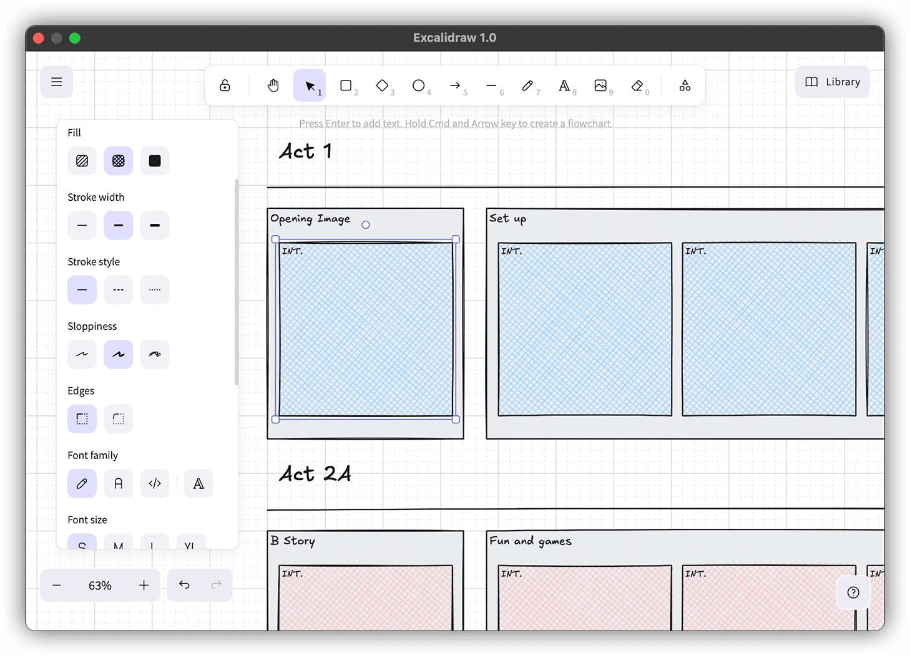

# Excalidraw

Use the <a href="https://excalidraw.com/" target="_blank">Excalidraw</a> app within your document.



## Developing

NodeJS and npm are required to install and build the plugin.

```sh
# Install all dependencies
npm i

# Develop the plugin in Beat with live refresh
npm run dev

# Develop just the front-end UI
npm run dev-ui

# Build just the plugin without installing
npm run build

# Build and install the plugin into Beat
npm run install
```
